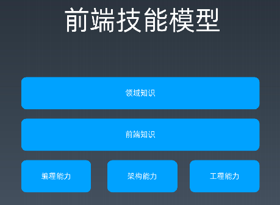
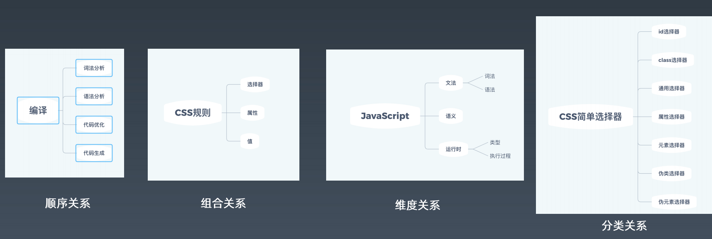
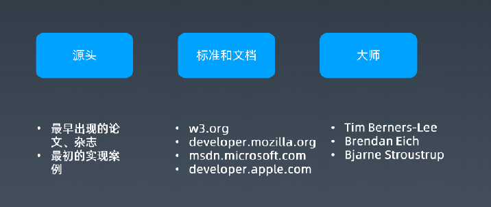

# 前端工程师的自我修炼之道      
时间：2020.4.7     

## 课程主题
1. 如何规划自己的前端职业生涯，站在更高起点？
2. 掌握正确的学习方法，破局成为前端专家
3. 企业眼中优秀的前端人是什么样的？
4. 在训练营中，我会如何带你进阶资深前端工程师？

## 思考问题
1. 关于前端，你都会什么？      
2. 关于前端，你都不会什么？

## 前端技能模型搭建   
       

* 编程能力：通俗的描述就是提出一个问题能否解决出来。编程能力解决的是：难，写不出来的问题。
即可以认为数据结构、算法题等，将一个复杂的逻辑问题拆分出来加以实现的能力，即可为编程能力。（岗位的基础）       
* 架构能力：架构能力是解决：大，写不出来的问题。架构能力包括了对复杂系统的分析，对复杂
系统所需要的程序进行软件设计，对代码的规范，多个程序员协同开发的管理等的架构。     
* 工程能力：工程能力解决的就是人多怎么协同的问题。     
* 前端知识： HTML/CSS/JavaScript/Node.js/浏览器相关API等。需要通过建立知识体系
来管理前端知识。              
* 领域知识：跟从事的领域有关系，需要所处行业和职业规划在实践中学习，例如新零售需要
做埋点分析等。     

其中，编程能力可以通过刻意练习的方式提升，例如刷题；而架构能力可通过读源代码，参与
开源项目的方式，例如可以通过带着目的，解决开源项目issue的问题的方式，不太建议通读
源代码。        

## 学习方法     

### 整理法
通过关系进行将知识串联。可以通过相关的知识点迅速定位对应的知识点。     
* 顺序关系      
* 组合关系      
* 维度关系      
* 分类关系              
整理知识体系还需要完备性，确保每个环节的完整。     
  

### 追朔法

## 权威参考     

* [https://www.w3.org/](https://www.w3.org/)        
* [http://w3school.com/](http://w3school.com/)      
* [https://whatwg.org/](https://whatwg.org/)      
* [https://scholar.google.com/](https://scholar.google.com/)      
* [https://developer.mozilla.org/](https://developer.mozilla.org/)      
* [https://docs.microsoft.com/](https://docs.microsoft.com/)      
* [https://developer.apple.com/](https://developer.apple.com/)      
       

