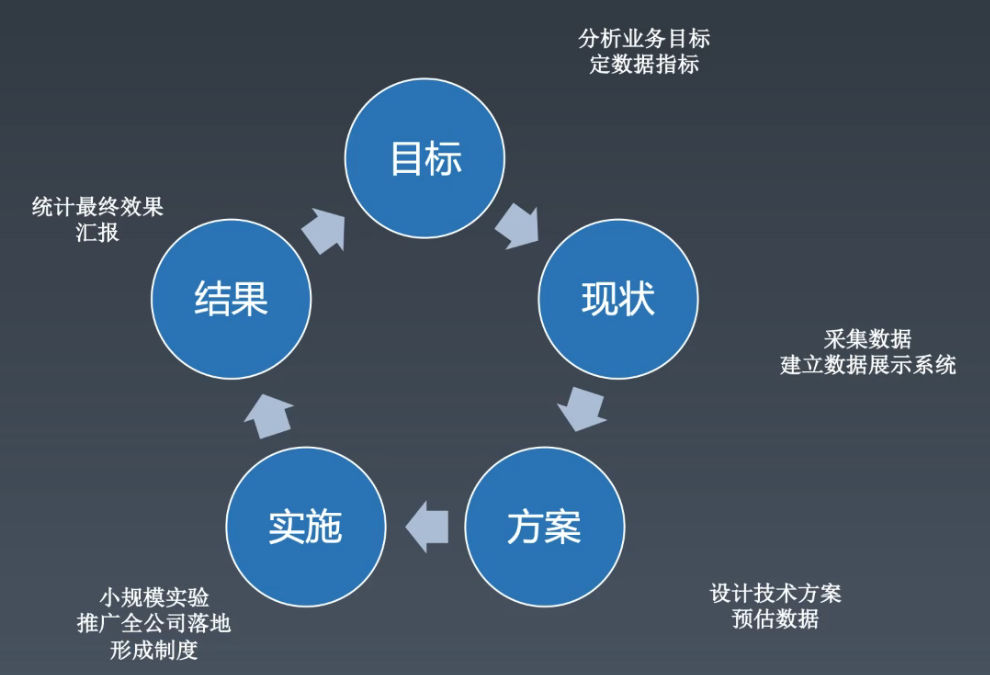

# 前端工程师的自我修炼之道      
时间：2020.4.7     

## 课程主题
1. 如何规划自己的前端职业生涯，站在更高起点？
2. 掌握正确的学习方法，破局成为前端专家
3. 企业眼中优秀的前端人是什么样的？
4. 在训练营中，我会如何带你进阶资深前端工程师？

## 思考问题
1. 关于前端，你都会什么？      
2. 关于前端，你都不会什么？

## 前端技能模型搭建   
       

* 编程能力：通俗的描述就是提出一个问题能否解决出来。编程能力解决的是：难，写不出来的问题。
即可以认为数据结构、算法题等，将一个复杂的逻辑问题拆分出来加以实现的能力，即可为编程能力。（岗位的基础）       
* 架构能力：架构能力是解决：大，写不出来的问题。架构能力包括了对复杂系统的分析，对复杂
系统所需要的程序进行软件设计，对代码的规范，多个程序员协同开发的管理等的架构。     
* 工程能力：工程能力解决的就是人多怎么协同的问题。     
* 前端知识： HTML/CSS/JavaScript/Node.js/浏览器相关API等。需要通过建立知识体系
来管理前端知识。              
* 领域知识：跟从事的领域有关系，需要所处行业和职业规划在实践中学习，例如新零售需要
做埋点分析等。     

其中，编程能力可以通过刻意练习的方式提升，例如刷题；而架构能力可通过读源代码，参与
开源项目的方式，例如可以通过带着目的，解决开源项目issue的问题的方式，不太建议通读
源代码。        

## 学习方法     

### 整理法
通过关系进行将知识串联。可以通过相关的知识点迅速定位对应的知识点。     
* 顺序关系      
* 组合关系      
* 维度关系      
* 分类关系              
整理知识体系还需要完备性，确保每个环节的完整。     
  

### 追朔法

## 权威参考     

* [https://www.w3.org/](https://www.w3.org/)        
* [http://w3school.com/](http://w3school.com/)      
* [https://whatwg.org/](https://whatwg.org/)      
* [https://scholar.google.com/](https://scholar.google.com/)      
* [https://developer.mozilla.org/](https://developer.mozilla.org/)      
* [https://docs.microsoft.com/](https://docs.microsoft.com/)      
* [https://developer.apple.com/](https://developer.apple.com/)      

# 前端技术体系
时间：2020.4.9     

前端技术体系划分：       
* HTML      
* JavaScript        
* CSS       
* API       
单独划分一个API是基于前端生态进行的划分，例如主流的是面向**浏览器**的API；还有基于**Node**的后台服务或者中间层实现；
另外有基于桌面应用开发的**Electron**和微信/支付宝/快应用等一些列的**小程序端**开发等。     

## HTML
基于**维度关系**对HTML进行分析，把HTML作为一种开发语言，继承了通用的计算机语言、SGML和XML。    
1. 通用的计算机语言
    * 语法        
    * 词法        
2. SGML     
标准通用标记语言(Standard Generalized Markup Language),它是国际上定义电子文件结构和内容描述的标准，
（SGML是一种在Web发明之前就早已存在的用标记来描述文档资料的通用语言）。         
它的组成包括语法定义，DTD，实例三部分。
    * DTD（Document Type Definition,即文档类型定义）            
    其中，HTML5的DTD即为：<! doctype html>     
    * Entity（实体）        
    例如，< 实体为&lt;解释为标签的开头；> 实体为&gt；解释为标签的结尾等 ，参考：[https://github.com/PCAaron/Frontend-01-Template/issues/2](https://github.com/PCAaron/Frontend-01-Template/issues/2)                 
3. XML      
Extentsible Markup Language(可扩展标记语言)，)用于标记电子文件使其具有结构性的标记语言，
可以用来标记数据、定义数据类型，是一种允许用户对自己的标记语言进行定义的源语言。             
    * Namespace   
    xmlns 属性可以在文档中定义一个或多个可供选择的命名空间。该属性可以放置在文档内任何元素的开始标签中。该属性的值类似于 URL，它定义了一个命名空间，
    浏览器会将此命名空间用于该属性所在元素内的所有内容。          
    可以认为和DTD一样，只是从不同的角度定义标签属性。      
    例如：<html  xmlns="http://www.w3.org/1999/xhtml" >        
    * Tag    
    
## JavaScript
通用基于**维度关系**对JavaScript分析，可以从文法/语法、语义和运行时来划分。     
1. 文法/语法   
    * 词法        
    空格符、换行符、注释、标识       
    * 语法(语法结构)             
    Atom(对应于词法的标识Token)、表达式、语句、函数、类等        
2. 语义       
3. 运行时      

## CSS  

## API

## 补充知识点及参考        

* SGML引申说明：             
GML 是第一代置标语言，使文档能明确将标示和内容分开，所以文件使用同样的标示方法。SGML 在 GML 的基础上进行整理，
形成了一套非常严谨的文件描述方法。    

* HTML元素(Tag)：[https://developer.mozilla.org/zh-CN/docs/Web/HTML/Element](https://developer.mozilla.org/zh-CN/docs/Web/HTML/Element)        

# 前端与工程体系
时间：2020.4.11        

## 互动-优秀的前端工程师      
* 帮助其他岗位了解前端，赋能他人搞定前端       
* 了解底层原理/系统架构，系统知识扎实，目标明确，技术能力强，视野宽广     

### winter眼中的优秀工程师      
* 领域知识          
    完整的领域知识体系    
* 能力/潜力     
    编程能力+架构能力+工程能力+潜力       
* 职业规划（执行能力）      
    工程师 -> 资深工程师 -> 专家 -> 经理        
* 成就        

## 职业规划     

     

### 职业发展       
#### 成就    

* 业务型成就     
标准：业务KPI        
要求：业务敏感，站在业务角度思考问题，有系统方法论进行持续的产出            
       
重中之重，首先理解公司的业务目标（理解公司业务的目标，目标转化为指标。），例如阿里的引导成交(GMV)，流量、转化率、客单价。     
接着将业务指标到技术指标的准化，形成纸面方案。     
接着方案实施(说明，把自己当成PM，牵头人)，最后进行数据采集结果评估。    
案例：例如tab组件添加手势操作，提高了点击率。通过编写通用tab组件向业务推广形成制度。                  

* 技术难题      
          
首先是一个公认的技术难点，例如所在公司团队公认的难以解决，简历中最好是行业中公认的，难度得到肯定的。      
案例：在某浏览器插件项目中，需要爬取各个网站价格比较，但是各个网站会采用图片价格等手段防御，例如引入js端的数字
识别技术，靠AI技术解决。       

* 工程型成就
唯一标准：有效              
      
目标提高质量或者效率。     
案例：XSS攻击的预防，通过整理安全手册，review历史代码，代码扫描工具更改代码发布流程减少XSS漏洞。      

## 工程概念（工程能力）     

### 工具链     
工具的分类：      
* 脚手架       
* 本地调试      
* 单元测试（例如spriteJS）      
* 发布        
工具链体系的设计：       
* 版本管理      
* 数据统计      

### 持续集成

## 技术架构（架构能力）     
客户端架构：解决软件需求规模带来的复杂性        
服务端架构：解决大量用户访问带来的复杂性       
前端架构：解决大量页面需求带来的重复劳动问题 

## 补充       

* 如何读开源项目       
深度学习开源项目            
1、写文档，了解开源项目文档的不足之处并修改              
2、接bug fit，debugger过程中阅读代码结构，追踪过程中对局部代码梳理       
简单了解开源代码，则可对当前代码片段进行断点调试并通读

* 数据驱动的思考方式（可关联业务型成就）     
      
目标：出技术方案之前需要确定目标，将目标转换为数据指标        
现状：采集数据，建立数据展示系统。需要有方案实施后的对比汇报      
方案：需要有预估数据      
实施：如对方案有不确定性，可进行小规模实验            
     

    

        
        

       

