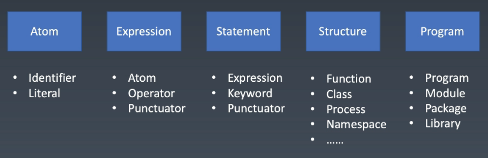
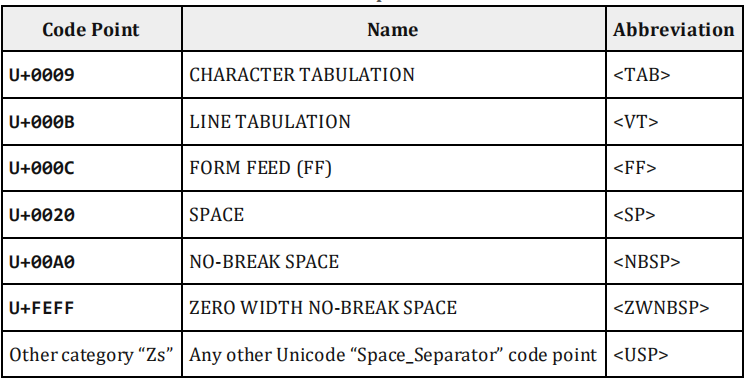
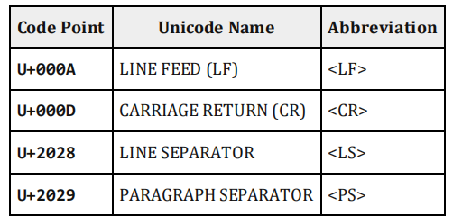

# 编程语言通识与JavaScript语言设计
时间：2020.4.16        

## 编程语言通识       
语言按语法分类     
* 非形式语言     
   中文、英文、...        
* 形式语言（分类法：<a href="#mark">乔姆斯基谱系</a>）      
    - 0- 型文法（无限制文法或短语结构文法）包括所有的文法。       
    格式：  ?::=?      
    形如： <a><b> :: = "c"（没有约束）           
    - 1- 型文法（上下文相关文法）生成上下文相关语言。       
    格式： ?<A>?::=?<B>?       
    形如： <a><b><c> ::= <a> "x" <c>(x在a和c的上下文中解析为b)       
    - 2- 型文法（上下文无关文法）生成上下文无关语言。       
    格式： <A> ::= ?
    形如： （不管在什么上下文情况下都产生A）
    - 3- 型文法（正规文法）生成正则语言。     
    格式： <A> ::=<A>?     

现代语言一般将文法分成词法和语法两个部分。词法会通过正则做处理，当单个词作为输入流进行语法分析。      

### 产生式(<a href="#bnf">BNF</a>)
理解形式语言需要了解产生式。      
* 用尖括号括起来的名称来表示语法结构名        
* 语法结构分成基础结构和需要用其他语言结构定义的复合结构       
    基础结构称终结符        
    复合结构称非终结符       
* 引号和中间的字符表示终结符     
* 可以有括号     
* *表示重复多次       
* |表示或      
* +表示至少一次       

### 其它产生式       
EBNF，ABNF Customized

### 现代语言的特例     
* JavaScript中，/可能是除号，也可能是正则表达式开头，处理方式类似于VB，字符串模板中耶需要特殊处理，还有自动插入
分号规则(1- 型文法)               
* Python中，行首的tab符和空格会根据上一行的行首空白以一定规则被虚拟终结符indent或者dedent                
* C++中，*可能表示乘号或者指针，具体是哪个，取决于星号前面的标识符是否被声明为类型(1- 型文法)            
* VB中，<可能是小于号，也可能是XML直接量的开始，取决于当前位置是否可以接受XML直接量(1- 型文法)     
    
## 图灵完备性        
* 命令式 —— 图灵机        
    goto        
    if和while        
* 声明式 —— lambda     
    递归  
    
## 动态与静态    
* 动态：
    再用户的设备/在线服务器上       
    产品实际运行时     
    Runtime     
* 静态：   
    在程序员的设备上        
    产品开发时       
    Compiletime     
    
### 类型系统        
* 动态类型系统与静态类型系统 （例如TypeScript才有静态类型系统）    
* 强类型与弱类型(存在隐式类型转型即为弱类型，例如C++)      
* 复合类型      
    结构体     
    函数签名        
* 子类型       
    逆变/协变     
    
## 一般命令式编程语言


## 补充

* <span id="mark">乔姆斯基谱系</span>：是计算机科学中刻画形式文法表达能力的一个分类谱系，是由诺姆·乔姆斯基于 1956 年提出的。    
     
* <span id="bnf">BNF</span>就是巴科特·瑙尔式的缩写，在计算机的史前时代（1950s)，他奠定了现代计算机的基础，包括了对形式语言的研究，和发明了高级语言：FORTRAN。
我们把他提出的一套描述语言的方法叫做BNF。它以递归方式描述语言中的各种成分，凡遵守其规则的程序就可保证语法上的正确性。    

* [带括号的四则运算产生式](./practices/BNF)            

* 图灵完备性：在可计算性理论里，如果一系列操作数据的规则（如指令集、编程语言、细胞自动机）可以用来模拟单带图灵机，
那么它是图灵完全的。这个词源于引入图灵机概念的数学家艾伦·图灵。虽然图灵机会受到储存能力的物理限制，
图灵完全性通常指“具有无限存储能力的通用物理机器或编程语言”。     

* 图灵机（Turing machine）：又称确定型图灵机，是英国数学家艾伦·图灵于 1936 年提出的一种将人的计算行为抽象掉的数学逻辑机，
其更抽象的意义为一种计算模型，可以看作等价于任何有限逻辑数学过程的终极强大逻辑机器。      

* [静态和动态语言](https://github.com/PCAaron/Frontend-01-Template/issues/3)


# JavaScript | 词法      
时间：2020.4.18

## 空格
     
```javascript
// TAB，对应unicode的字符集位置是9
"\u0009"
"	"
"	".codePointAt/charCodeAt(0) .toString(16)
"9"
// SPACE，对应unicode的字符集位置是20
"\u0020"
" "
" ".codePointAt(0)/charCodeAt .toString(16)
"20"
```   
* NBSP:不换行空格（英语：no-break space，NBSP）是空格字符，用途是禁止自动换行。
HTML 页面显示时会自动合并多个连续的空白字符（whitespace character），但该字符是禁止合并的，
因此该字符也称作“硬空格”（hard space、fixed space）。      
* ZWSP:零宽空格，（zero-width space, ZWSP）是一种不可打印的 Unicode 字符，用于可能需要换行处。
在 HTML 页面中，零宽空格可以替代。但是在一些网页浏览器（例如 Internet Explorer 的版本 6 或以下）不支持零宽空格的功能。      

## 换行
    
* LF: 换行，'\n'           
* CR: 回车，'\r'       

## 注释       
* SingleLineCommet（单行注释//）      
* MultiLineCommet（多行注释/**/）     

## Token
* Identifier(变量)    
    变量名     
    属性名(属性名可以跟关键字重合)   
* Literal(直接量)      
    NumberLiteral(数字直接量)        
    StringLiteral(字符直接量)        
* Punctuator(运算符)       
* Keywords      

### Literal
#### NumberLiteral
数字由IEEE 754 Double Float表示，其中组成部分：     
* 符号位Sign(1)        
* 指数Exponent(11)        
* 精度Fraction(52)        

数字可分成十进制DecimalLiteral（说明，其中1e3/1E3，为1000）、八进制OctallIntegerLiteral(0o开头)、
二进制BinaryIntegerLiteral(0b开头)、十六进制HexIntegerLiteral(0x开头)
```javascript
0b10 // 等价parseInt('10',2)/10 .toString(2)
2 //二进制输出

0x11// 等价parseInt('17',16)
17 //十六进制输出

0o10// 等价parseInt('10',8)
8 //八进制输出

10// 等价parseInt('10')
10
```

#### StringLiteral
* Character(字符)     
* Code Point(码点)      
* Encoding      
    UTF
    
字符集包含的集合有：      
* ASCII     
* Unicode       
* UCS（U+0000 - U+FFFF）      
* GB（国标）        
    GB2312      
    GBK     
    GB18030     
* ISO-8859(欧洲)      
* BIG5(繁体)      

## 补充

* 字符集：字符编码（英语：Character encoding）、字集码是把字符集中的字符编码为指定集合中某一对象
（例如：比特模式、自然数序列、8 位组或者电脉冲），以便文本在计算机中存储和通过通信网络的传递。
常见的例子包括将拉丁字母表编码成摩斯电码和 ASCII。其中，ASCII 将字母、数字和其它符号编号，
并用 7 比特的二进制来表示这个整数。通常会额外使用一个扩充的比特，以便于以 1 个字节的方式存储。
在计算机技术发展的早期，如 ASCII（1963 年）和 EBCDIC（1964 年）这样的字符集逐渐成为标准。
但这些字符集的局限很快就变得明显，于是人们开发了许多方法来扩展它们。
对于支持包括东亚 CJK 字符家族在内的写作系统的要求能支持更大量的字符，并且需要一种系统而不是临时的方法实现这些字符的编码。   

* ASCII ：（American Standard Code for Information Interchange，美国信息交换标准代码）
是基于拉丁字母的一套电脑编码系统。它主要用于显示现代英语，而其扩展版本延伸美国标准信息交换码则可以部分支持其他西欧语言，
并等同于国际标准 ISO/IEC 646。美国信息交换标准代码是这套编码系统的传统命名，互联网号码分配局现在更倾向于使用它的新名字 
US-ASCII[2]。美国信息交换标准代码是美国电气和电子工程师协会里程碑之一。       

* [Unicode](https://www.fileformat.info/info/unicode/) ：中文：万国码、国际码、统一码、单一码。是计算机科学领域里的一项业界标准。它对世界上大部分的文字系统进行了整理、
编码，使得电脑可以用更为简单的方式来呈现和处理文字。      

* Math.abs(0.1+0.2-0.3) <= Number.EPSILON:当判断小于精度即可认为相等/转换为整数进行比较


